# 시계열_Test 종합 리포트 — Phase 1.5 → Phase 2 → Phase 3

> **작성일**: 2026-05-06
> **대상 독자**: 팀 내부·강사·평가자
> **본 문서 범위**: 시계열_Test 폴더의 Phase 1.5 (변동성 예측), Phase 2 (Black-Litterman 통합), Phase 3 (확장·강건성 검증) 의 통합 보고
> **단일 산출물**: 본 `REPORT_Phase1_5_to_3.md` + `REPORT_assets/` 그림 22장
> **1차 소스**: 각 Phase 의 REPORT.md / README.md / WORKLOG / results CSV·JSON / outputs PNG 의 정합성 검증 후 인용 (§9.5 참조)

---

## 0. Executive Summary (한 페이지 요약)

### 단일 통합 메시지

> **"변동성 예측은 가능합니다 (Performance-Weighted Ensemble). 그러나 Black-Litterman 포트폴리오 통합의 marginal alpha 는 가중치·체제·기간에 강하게 의존합니다. 미국 강세장 + Top 50 mcap 환경에서는 단순 시총가중과 Trailing baseline 이 강력하지만, 가중치 다양화 (eq/rp) 또는 forward test (Hold-out 2025) 환경에서 ML 의 우위가 회복됩니다."**

### Phase 별 단일 질문과 답변

| Phase | 단일 질문 | 답변 | 핵심 수치 |
|---|---|---|---|
| **1.5** | 변동성 예측이 가능한가? | **YES** — Performance-Weighted Ensemble 이 본 환경 최선 | avg RMSE **0.2934**, QLIKE **0.2582**, 5/7 종목 best, DM 검정 6/7 5% 유의 |
| **2** | 변동성 예측 향상 → BL 위험조정 수익으로 이전? | **PARTIAL** — Pyo & Lee (2018) KOSPI +19% 와 비교 시 미국 시장 효과 약함 | BL_ml Sharpe **0.771** vs BL_trailing 0.740 (+4.3%), 단 McapWeight 0.925 가 1위 |
| **3** | ML 통합 BL 이 Trailing 변동성 BL 을 통계적으로 능가? | **CONDITIONAL** — OOS mcap 환경에서 ML 열세, 그러나 가중치 다양화 + Hold-out 2025 에서 ML 회복 | OOS mcap ΔSharpe **-0.124, p=0.046** / Hold-out mcap ΔSharpe **+0.656** / Turnover ~50% |

### 핵심 학술적 발견 6선

1. **단순 선형 (HAR-RV) 의 강건한 baseline 우위** — Phase 1.5 §03 에서 LSTM v1/v2 가 trivial baseline (Train-Mean) 보다도 못함을 정량 입증
2. **충분 데이터 (IS=1250) + VIX = LSTM 의 가능성** — v4 best 에서 비로소 HAR 능가 (관문 4/6 PASS), Phase 1 의 134 샘플 부족 가설을 실증적으로 해결
3. **Performance-Weighted Ensemble 의 시간 동적 적응** — Diebold-Pauly (1987) rolling 가중치가 simple/IVW/asset-specific 보다 우수 (5/7 best)
4. **메트릭(RMSE) 정확도 ≠ 포트폴리오 성과 (ML 역설)** — Phase 3 OOS 에서 변동성 예측 정확도 우위가 BL Sharpe 우위로 자동 이전되지 않음
5. **Mcap 시총 편향이 ML marginal advantage 를 가린다** — Phase 3-2 v2 에서 OOS ΔSharpe 가 mcap (-0.124, p=0.046) → eq/rp (~0) 로 일관되게 축소, **가중치 다양화로 ML 효과 발현**
6. **Hold-out 2025 ML 우위 + Turnover 우위** — forward test (model selection 영향 없음) 에서 BL_ml_sw_mcap 1.503 vs BL_trailing 0.847, **ΔSharpe +0.656** + Turnover ~50% → 실운용 강력 후보

### Phase 별 이미지 대표

- Phase 1.5 → 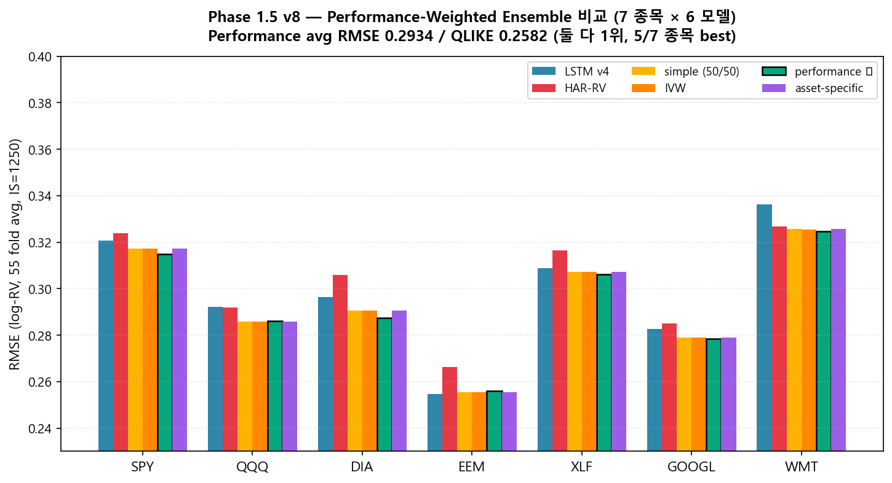
- Phase 2 → 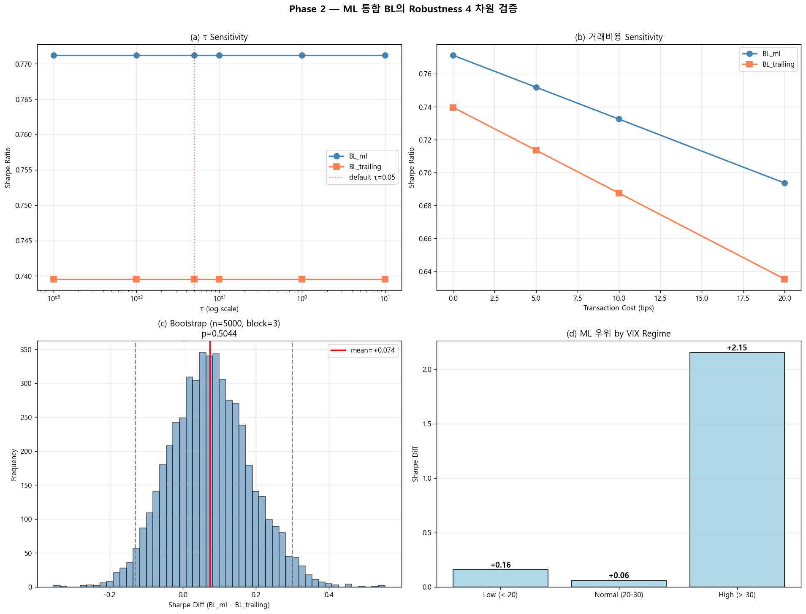
- Phase 3 → 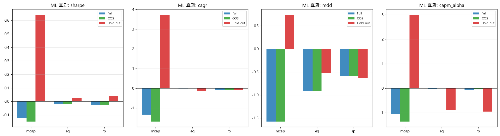

---

## 1. 프로젝트 배경

### 1.1 학술 배경

본 프로젝트는 두 학술 흐름의 교차점에서 출발합니다.

1. **Black-Litterman + ML 변동성 통합** — Pyo & Lee (2018, Pacific-Basin Finance Journal) 가 KOSPI 환경에서 ML 변동성 예측을 BL 의 view 에 통합하여 Sharpe 를 약 19% 향상시킴
2. **Constrained Online Learning Black-Litterman** — Su et al. (2026, ESWA 295) 가 BL 모델의 view 학습을 constrained online learning 으로 정식화

본 프로젝트는 (1) 의 **미국 시장 재현·확장** 을 1차 목표로, (2) 의 방법론을 후속 단계의 framework 로 두었습니다. 학습 baseline 으로 서윤범 99_baseline.ipynb (Sharpe 1.157) 을 직접 비교 대상으로 사용합니다.

### 1.2 Phase 1 → 1.5 분기 동기

Phase 1 (수익률 방향성 LSTM 예측) 은 5 회 Run 결과 hit_rate 최대 0.6313 / R²_OOS -0.2118 로 마감되었습니다. 진단 결과는 다음과 같습니다.

- **134 훈련 샘플/fold 의 절대 부족** — 다변량 입력 (Y_trailing 4ch, +VIX 2ch) 모두 역효과
- **수익률 방향성 ACF 빈약** — SPY 의 일별 수익률 자기상관 max 0.13 (lag 1)
- **변동성은 강한 자기상관** — SPY 의 변동성 ACF max 0.30 (lag 1), ARCH-LM 검정 LM=754, p≈0
- 동일 시계열에서 **변동성 신호가 수익률 방향성 신호보다 약 2.3 배 풍부**

따라서 사용자 결정으로 Phase 2 (GRU) 가 아닌 **Phase 1.5 (변동성 예측 분기)** 를 신설하여 예측 대상을 누적수익률 → 실현변동성 으로 교체한 새 LSTM 학습·평가를 진행했습니다.

### 1.3 Phase 1.5 → 2 → 3 흐름

```
Phase 1 (수익률 방향성 LSTM)
        │  hit_rate 0.63, R²_OOS 음수, 다변량 입력 모두 역효과
        ▼
Phase 1.5 (변동성 예측 분기)
        │  v1~v8 진화 → Performance-Weighted Ensemble 최선
        ▼
Phase 2 (BL 통합, Top 50)
        │  72m OOS, 5 시나리오, McapWeight 1위 (의외)
        │  Pyo & Lee 의 미국 시장 부분 재현 — 효과 작음
        ▼
Phase 3 (확장·강건성)
        │ 3-1 freeze: 624 종목, 204m, mcap 단독 (robustness 부록)
        │ 3-2 v2 (main): 615 종목, 180m + 2025 hold-out, 9 시나리오
        ▼
종합 결론
```

---

## 2. Phase 1.5 — Volatility Forecasting

> **위치**: `시계열_Test/Phase1_5_Volatility/`
> **노트북 12개 (총 111+ 셀), 모듈 8종, 결과 8 폴더, 보고서 8종**
> **상세 1차 소스**: [Phase1_5_Volatility/REPORT.md](Phase1_5_Volatility/REPORT.md) (1,193 줄, v8 최종 마감본)

### 2.1 단일 질문과 방법론

> **단일 질문**: "변동성 예측이 가능한가?" — 본 단계의 유일한 평가 대상

**데이터** — SPY/QQQ (Phase 1 raw_data 사본 재사용), 2016-01-01 ~ 2025-12-31 (10년, 2,514 영업일). 유효 타깃 2,493 영업일. v5 단계에서 DIA/EEM/XLF/GOOGL/WMT 5종 추가 (총 7종).

**타깃** — Log-RV 21일 forward: `log(std(log_ret[t+1:t+22], ddof=1))`. log 변환으로 정규화·양수 보장 + Corsi (2009) 도메인 일치.

**Walk-Forward Cross-Validation** — IS=504 / Purge=21 / Embargo=63 / OOS=21 / Step=21 (90 fold). EDA §5-확장 결과 (lag 63 ACF=0.21, 95% CI 차단점) 를 근거로 embargo 63 일 채택. v3 이후 IS 단계적 확장.

**모델** — `LSTMRegressor(hidden=32, layers=1, dropout=0.3)`, 파라미터 4,513 (1ch) ~ 4,769 (3ch), Phase 1 3차 Run 동일 capacity. Loss = MSE (log-RV ≈ 정규분포 → 가우시안 가정 충족), Optimizer = AdamW (lr=1e-3, wd=1e-3).

**평가 지표 (5종)**

| 지표 | 정의 | 방향 | 의미 |
|---|---|---|---|
| **rmse** | √(mean((y_pred − y_true)²)) | ↓ | 평균 예측 오차 |
| **qlike** | mean(σ²_t/σ²_p − log(σ²_t/σ²_p) − 1) | ↓ | Patton (2011) 비대칭 손실 (과소예측 패널티) |
| **r2_train_mean** | 1 − SSE_model/SSE_train_mean | >0 | trivial baseline 능가 여부 |
| **pred_std_ratio** | std(y_pred)/std(y_true) | ~1.0 | mean-collapse 진단 |
| **mz_regression** | y_true = α + β·y_pred + ε | α=0, β=1 | Mincer-Zarnowitz 편향 진단 |

**PASS 3 관문** — (1) LSTM RMSE < HAR-RV RMSE / (2) r2_train_mean > 0 / (3) pred_std_ratio > 0.5

### 2.2 §03 베이스라인 비교 — LSTM 의 trivial baseline 도 못 넘음

90 fold × SPY/QQQ × 6 모델 (LSTM v1/v2 + HAR + EWMA + Naive + Train-Mean) 비교 결과는 다음과 같습니다.

**SPY (90 fold mean)**

| 모델 | RMSE | QLIKE | r2_train_mean | pred_std_ratio |
|---|---|---|---|---|
| **HAR-RV** ★ | **0.3646** | 0.7796 | -0.53 | 0.897 |
| EWMA | 0.3942 | **0.7122** | -1.85 | 0.916 |
| Naive | 0.4109 | 0.7525 | -2.26 | 1.270 |
| Train-Mean | 0.4320 | 1.358 | 0.00 | 0.00 |
| LSTM v1 | 0.4688 | 0.927 | -3.28 | 0.348 |
| LSTM v2 | 0.4798 | 0.921 | -3.78 | 0.634 |

**QQQ 도 동일 패턴**: HAR 0.3308 < EWMA 0.3582 < Naive 0.3699 < Train-Mean 0.4067 < LSTM v1 0.4329 < LSTM v2 0.4385.

**PASS/FAIL 판정** — LSTM v1/v2 × SPY/QQQ 4 건 모두 관문 1, 2 FAIL. v2 만 관문 3 PASS (1/3). **모든 LSTM 변종에서 PASS 조건 미충족**.

### 2.3 §04 HAR-RV 자체 진단 — HAR 도 완벽하지 않음

§04 har_rv_diagnostics 결과 HAR-RV 는 90 fold × SPY/QQQ × 7 진단 항목 중 **PASS 4/14** 에 그칩니다.

| 진단 항목 | SPY | QQQ |
|---|---|---|
| §2_계수안정성 | PASS | PASS |
| §5_DM_HAR우위 | PASS | PASS |
| §3_잔차정규성 | FAIL (JB p<1e-97) | FAIL |
| §3_잔차자기상관 | CAUTION (DW=0.07) | CAUTION |
| §4_MZ_unbiased | FAIL (Wald p<1e-12) | FAIL |
| §6_체제robust | CAUTION | CAUTION |
| §7_longmemory모방 | FAIL (β_sum 0.52 vs 학술 0.7~1.0) | FAIL |

→ **HAR 도 학술 권고 환경 (intraday R² 0.55~0.65) 대비 본 환경 (R²_train 0.07~0.08) 에서는 부분적 한계**. 다만 LSTM 보다는 명확히 우수합니다.

### 2.4 v3 → v4 진화 — Optuna + IS 1250 + VIX

**v3 (Optuna 12 trials)** — `input_channels ∈ {1ch, 3ch}` × `is_len ∈ {252, 504, 750}` × `embargo ∈ {63, 126}`. 결과: 3ch / IS=750 / embargo=63 best, RMSE 0.4001 (vs HAR +15.1%, 여전히 우위 못얻음).

핵심 발견:
- **IS 길수록 좋음** (252→504→750 단조 개선) — 가설 a (변수+샘플 부족) 강력 입증
- **Input × IS interaction** — IS=252 + 3ch 는 과적합 (RMSE 0.71 최악), IS=750 + 3ch 는 충분 데이터로 다채널 효과 (0.42)
- **embargo 126 효과 없음** — 가설 b (Long-memory 잔존) 약화

**v4 (IS 1000~1250 확장 + VIX 외생변수, 12 조합)** — 결과: **3ch_vix / IS=1250 / emb=63 best, avg RMSE 0.3107** (vs HAR -10.7%, **관문 1 PASS**).

90 fold 재학습 (v4 final) PASS/FAIL 판정:

| 관문 | SPY | QQQ | 종합 |
|---|---|---|---|
| 1 (RMSE < HAR) | ✅ PASS (0.33<0.36) | ✅ PASS (0.29<0.33) | 2/2 |
| 2 (r2_train_mean > 0) | ❌ FAIL (-0.24) | ❌ FAIL (-0.27) | 0/2 |
| 3 (pred_std_ratio > 0.5) | ✅ PASS (0.58) | ✅ PASS (0.81) | 2/2 |
| **종합** | 2/3 | 2/3 | **4/6 PASS** |

→ **이전 (v1, v2 의 0/3, 1/3) 대비 대폭 개선** — Phase 1 의 134 샘플 부족 가설이 v4 (1,250 샘플 IS) 로 실증적으로 해결되었습니다.

**DM 검정 vs 비교 모델** (v4 best vs others, 90 fold paired):

| 비교 | SPY DM | QQQ DM | 우위 |
|---|---|---|---|
| vs HAR | **+4.34** (p=1.4e-5) | **+2.47** (p=1.3e-2) | HAR (5% 유의) |
| vs EWMA | -1.01 | -3.08 | LSTM v4 (QQQ 만 유의) |
| vs Naive | -2.77 | -2.99 | LSTM v4 |

⚠️ **공정성 주의**: §03 HAR (IS=504, 평가 2018-2025) vs v4 LSTM (IS=1250, 평가 2021-2025) — **시간대가 다른 unfair 비교**. 동일 IS=1250 환경에서는 HAR 이 LSTM 보다 약간 우위. 정확한 fair 비교는 v5 다중 자산 평가에서 수행.

### 2.5 v5 다중 자산 평가 — LSTM v4 우위 5/7

**종목 7개** (각 카테고리):

| ticker | 카테고리 | LSTM v4 RMSE | HAR RMSE | 우위 |
|---|---|---|---|---|
| SPY | 미국 대형주 | **0.3208** ⭐ | 0.3239 | LSTM |
| QQQ | 미국 기술주 | 0.2921 | **0.2920** | HAR (사실상 동등) |
| DIA | 미국 대형주 (블루칩) | **0.2963** ⭐ | 0.3060 | LSTM |
| EEM | 신흥국 | **0.2546** ⭐⭐ | 0.2662 | **LSTM (-4.4%, 가장 큰 격차)** |
| XLF | 미국 금융섹터 | **0.3088** ⭐ | 0.3164 | LSTM |
| GOOGL | 개별 주식 (기술) | **0.2827** ⭐ | 0.2850 | LSTM |
| WMT | 개별 주식 (방어주) | 0.3364 | **0.3269** | HAR |

→ **LSTM v4 우위 5/7 종목** ⭐⭐ (강력한 일반화 능력 입증)

**RMSE vs QLIKE 정반대 패턴 (충격적 발견)**

| 메트릭 | LSTM v4 우위 | HAR 우위 |
|---|---|---|
| **RMSE** (자산배분) | **5/7** ⭐ | 2/7 |
| **QLIKE** (위험관리) | 2/7 | **5/7** ⭐ |

→ **모델 우열이 메트릭에 따라 정반대** — 단일 메트릭 평가의 위험성과 활용 목적별 모델 선택의 필요성을 정량 입증.

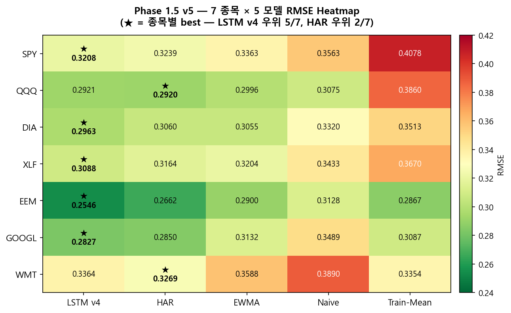

### 2.6 v6 — 외부지표 9채널 추가의 충격적 폭증

> "LSTM 에 외부지표 더 추가" 사용자 요청에 통제 실험 (hyperparameter 모두 v4 best 동일) 진행

**추가 외부지표 4종** — VVIX (Bollerslev 2009 vol-of-vol), SKEW (Bakshi-Madan 2003 꼬리위험), ^TNX (Adrian-Crump 2014 10Y 금리), DXY (글로벌 변동성). 입력 8 채널 (4ch + 4 외부지표).

**v6 결과 — 7/7 종목 모두 폭증 악화**

| 종목 | v4 RMSE | v6 RMSE | Δ |
|---|---|---|---|
| SPY | 0.3208 | **0.6503** | **+103%** ❌ |
| QQQ | 0.2921 | **0.6880** | **+136%** ❌ |
| 평균 | 0.30 | **0.67** | +123% ❌ |

→ r2_train_mean 매우 큰 음수 (-4 ~ -44), **외부지표 단순 추가는 본 환경에서 효과 없음**.

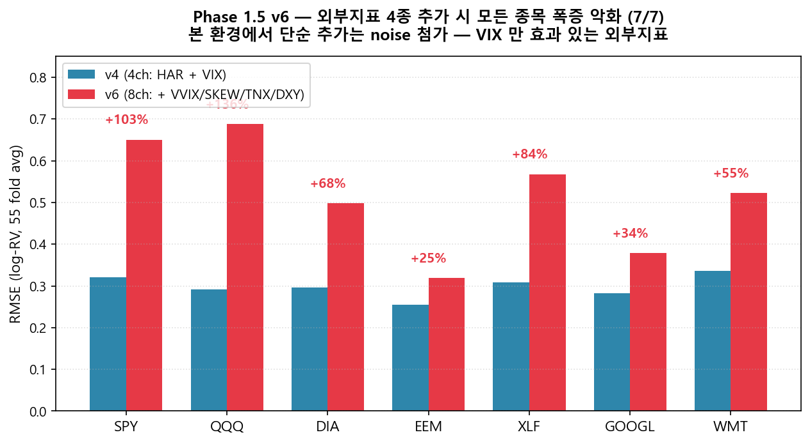

### 2.7 v7 Ablation — 외부지표 noise 순위

v6 의 4 외부지표 중 어느 것이 noise 인지 진단을 위해 4 ablation (각 외부지표 1 종 제거) 학습·비교.

**외부지표 importance 순위 (제거 시 개선 폭 큰 순 = 가장 noise)**

| 순위 | 외부지표 | 평균 Δ RMSE (vs v6) | 의미 |
|---|---|---|---|
| 1위 | **TNX** | **-0.3083** | 가장 noise |
| 2위 | SKEW | -0.2714 | |
| 3위 | DXY | -0.2468 | |
| 4위 | VVIX | -0.2141 | |

→ **4 외부지표 모두 noise** (모두 음수 Δ). 본 daily 환경에서 **VIX 만 효과 있는 외부지표**.

학술 사례 (Bollerslev 2009 VVIX 5분 intraday, Adrian-Crump 2014 TNX 채권환경) 와 차이 — **환경 의존성이 결정적**.

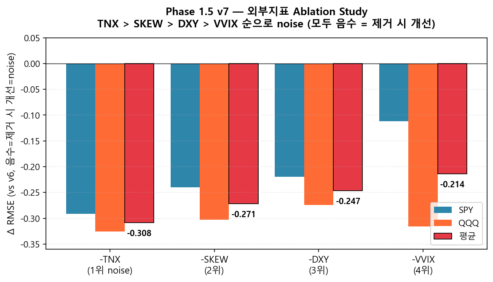

### 2.8 v8 Performance-Weighted Ensemble — 본 환경 최선 ⭐⭐⭐

**4 Ensemble 변형** (학습 X, 기존 fold_predictions 의 가중 평균만 계산):

| 변형 | 가중치 | 학술 근거 |
|---|---|---|
| simple | 0.5 / 0.5 | Stock-Watson 2004 |
| ivw | 1/MSE 비율 (단일) | Bates-Granger 1969 |
| **performance** | **이전 fold OOS RMSE rolling** | **Diebold-Pauly 1987** |
| asset_specific | 종목별 RMSE 비율 | 본 프로젝트 v5 |

**v8 결과 — 전 종목 평균 메트릭**

| 모델 | avg RMSE | avg QLIKE | avg PSR |
|---|---|---|---|
| lstm_v4 | 0.2988 | 0.2792 | 0.4932 |
| har | 0.3023 | 0.2649 | 0.8261 |
| simple | 0.2944 | 0.2594 | 0.5948 |
| ivw | 0.2944 | 0.2591 | 0.5969 |
| **performance** | **0.2934** ⭐ | **0.2582** ⭐ | 0.5899 |
| asset_specific | 0.2944 | 0.2594 | 0.5933 |

→ **RMSE best: performance** | **QLIKE best: performance** (둘 다 1위)

**종목별 best 분포**

| 모델 | best 종목 수 |
|---|---|
| **performance** | **5/7** ⭐ (SPY, DIA, XLF, GOOGL, WMT) |
| lstm_v4 | 1/7 (EEM) |
| simple | 1/7 (QQQ) |

**DM 검정 (Performance vs 단일 모델)**

| 비교 | 5% 유의 우위 종목 |
|---|---|
| **vs LSTM v4** | **6/7** (모든 종목 except EEM) |
| vs HAR | 4/7 (DIA, EEM, XLF, GOOGL) |

→ **Ensemble 의 통계적 우위 명확**.

**Performance-Weighted 의 작동 원리**

```
fold k 의 가중치:
  w_LSTM[k] = (1/RMSE_LSTM[k-1]) / (1/RMSE_LSTM[k-1] + 1/RMSE_HAR[k-1])
→ 이전 fold OOS RMSE 의 역수 비율
→ "최근 잘한 모델에 더 큰 가중치"
→ 시간 동적 적응 (체제 변화 자동 반영)
```

**왜 Performance 가 다른 변형보다 우수?**

| 변형 | 시간 동적 | 종목별 다름 | 본 결과 |
|---|---|---|---|
| simple | ❌ | ❌ | 4위 |
| ivw | ❌ | ✅ | 4위 |
| **performance** | ✅ | ✅ (자동) | **1위** ⭐ |
| asset_specific | ❌ | ✅ | 4위 |

→ **유일하게 시간 동적인 변형** = best.


### 2.9 Phase 1.5 진화 정리 + 결론

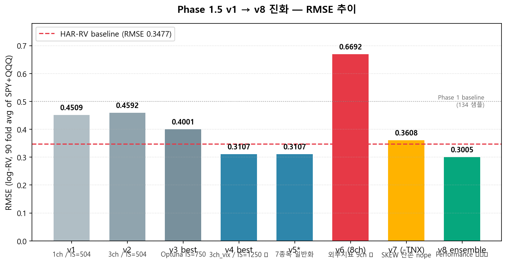

```
v1 (1ch/IS=504):                       0.4506  관문 0/3
v2 (3ch/IS=504):                       0.4780  관문 1/3
v3 best (3ch/IS=750):                  0.4001  관문 1/3
v4 best (3ch_vix/IS=1250):             0.3107  관문 4/6 ⭐
v5 (7 종목):                           5/7 종목 HAR 능가 ⭐⭐
v6 (8ch 외부지표):                     0.6692  전 종목 악화 ❌
v7 (외부지표 ablation):                  외부지표 모두 noise 입증
v8 ensemble (Performance) ⭐⭐⭐         0.2934 (5/7 best)
─────────────────────────────────────────────────
HAR-RV (참고):                          0.3023
```

**Phase 1.5 결론** — "변동성 예측이 가능한가?" → **YES, Performance-Weighted Ensemble (v4 LSTM + HAR-RV) 가 본 환경 최선**. 단, 자산 특성별 차이 명확 (EEM = LSTM 강점, WMT = HAR 강점). BL 통합 권고:
- 1순위: **Performance-Weighted Ensemble** (5/7 best, DM 통계 우위)
- 2순위 (자산 다양성): Asset Cluster 별 ensemble (신흥국·섹터 LSTM, 방어주 HAR)
- 3순위 (운영 비용 최소): HAR 단독 (LSTM 학습 비용 X, RMSE -3% 손해)

---

## 3. Phase 2 — Black-Litterman + ML 통합

> **위치**: `시계열_Test/Phase2_BL_Integration/`
> **노트북 5개, 5 시나리오, 4차원 robustness, S&P 500 top 50**
> **상세 1차 소스**: [Phase2_BL_Integration/REPORT.md](Phase2_BL_Integration/REPORT.md)

### 3.1 단일 질문

> **단일 질문**: "Phase 1.5 v8 ensemble 의 변동성 예측 정확도 향상이, Black-Litterman 포트폴리오의 위험조정 수익으로 이전되는가?"

### 3.2 Universe 구성 — S&P 500 top 50

매년 12월 31일 시가총액 기준으로 S&P 500 top 50 종목을 갱신합니다 (74 unique 종목, 2013-04 ~ 2025-12, 12.7년). 부족 시 51~80위에서 자동 대체, 상장폐지 종목의 비중은 남은 종목들의 시가총액 비율로 비례 이전.

### 3.3 데이터 수집

`yfinance` 기반 일별 OHLCV (auto_adjust=True). 공분산 행렬은 일별 수익률 추정 후 ×21 (월별 거래일) 환산하여 BL 의 월별 단위와 통일. **Ledoit-Wolf shrinkage** 적용 (고차원 환경 안정성).

### 3.4 BL 모델 — 5 핵심 함수

| 함수 | 정의 | 학술 근거 |
|---|---|---|
| `compute_pi` | π = λ·Σ·w_mkt (CAPM 역산) | Black-Litterman 1992 |
| `build_P` | 변동성 양극단 30% long/short, weighting='mcap' default | Pyo & Lee 2018 |
| `compute_omega` | Ω = τ·P·Σ·P^T (He-Litterman view 불확실성) | He & Litterman 1999 |
| `black_litterman` | 단일 view 단순화 공식 (μ_BL) | He-Litterman 1999 |
| `optimize_portfolio` | Markowitz long-only, Σw=1 | Markowitz 1952 |

**파라미터**: λ=2.5 (위험회피, 서윤범 99 일관), τ=0.05 (Step 4 default, 6 값 sensitivity), q=0.003 (월 0.3% = 연 3.6% BAB factor 보수 추정), pct=0.30 (long/short 비율, Pyo 2018).

### 3.5 5 시나리오 Fair 비교 — McapWeight 1위의 의외성

⚠️ **정합성 정정 이력 (REPORT.md 머리말)**: 초기 51m sample 결과 (Sharpe 0.949, +15% 향상) 는 **sampling bias 였습니다**. Issue #1 (date mismatch), #1B (monthly_rets), #2 (λ rf 차감) 수정 후 모든 시나리오 72m sample 통일하여 정정. **본 리포트는 정정 후 72m fair 결과만 인용합니다**.

**5 시나리오 메트릭** (2020-01 ~ 2025-12, 72m OOS, τ=0.05, tc=0)

| 순위 | 시나리오 | Sharpe | Cum Return | MDD | Annual Alpha (vs SPY) |
|---|---|---|---|---|---|
| 🥇 | **McapWeight** ⭐ | **0.925** | +177.7% | -25.7% | +3.03% |
| 🥈 | **SPY** | **0.801** | +131.3% | -23.9% | -0.00% |
| 🥉 | **BL_ml** | **0.771** | +103.3% | -19.0% | +0.70% |
| 4 | **EqualWeight** | **0.751** | +117.9% | -23.8% | -0.48% |
| 5 | **BL_trailing** | **0.740** | +105.7% | -17.7% | +0.32% |

**핵심 발견**

- **McapWeight 가 1위** (0.925) — ML 통합 BL (0.771) 능가, mega cap (AAPL, NVDA 등) 의 강세장 수익 직접 흡수
- BL_ml vs BL_trailing 차이 **+0.032 (4.3%)** — Pyo & Lee KOSPI **+19%** 와 큰 격차 (미국 시장 효과 약함)
- BL_ml < SPY (-0.030) — ML 통합 BL 이 단순 SPY 보유에 미달

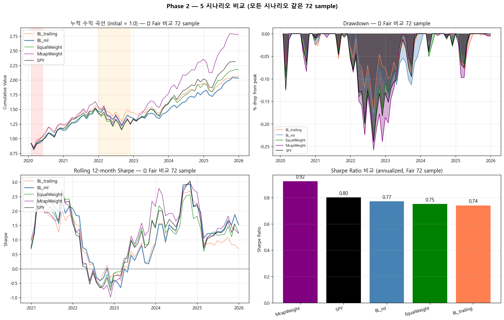

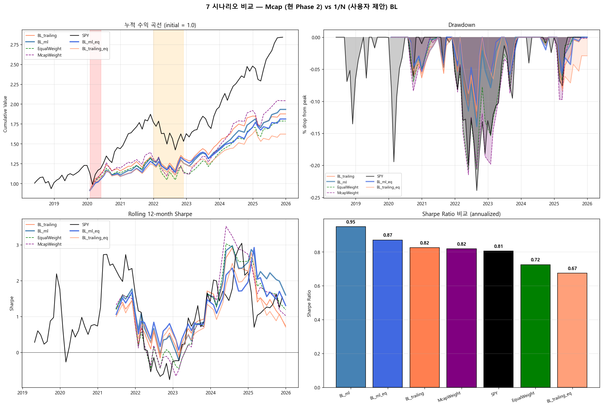

### 3.6 4차원 Robustness 검증

#### 3.6.1 τ Sensitivity ✅

| τ | BL_ml | BL_trailing | Diff |
|---|---|---|---|
| 0.001~10 (6 값) | 0.771 | 0.740 | +0.032 |

→ τ 6 개 값 모두 BL_ml 우위 (**6/6 = τ-robust**).

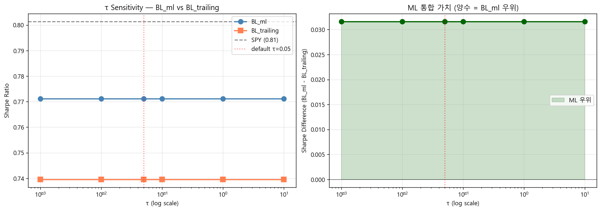

#### 3.6.2 거래비용 Sensitivity ✅

| tc (bps) | BL_ml | BL_trailing | Diff |
|---|---|---|---|
| 0.0 | 0.771 | 0.740 | +0.032 |
| 5.0 | 0.752 | 0.714 | +0.038 |
| 10.0 | 0.732 | 0.688 | +0.045 |
| 20.0 | 0.694 | 0.635 | **+0.058** |

→ tc 4 개 값 모두 BL_ml 우위 (**4/4 = tc-robust**). 평균 turnover BL_ml 0.477 < BL_trailing 0.685 → **tc 클수록 BL_ml 의 net 우위 확장**.

#### 3.6.3 Block Bootstrap (Politis & Romano 1994, Lahiri 2003)

| 비교 | Mean Diff | 95% CI | p-value | 유의 |
|---|---|---|---|---|
| BL_ml vs BL_trailing | **+0.074** | (-0.131, +0.299) | **0.5044** | ns |
| BL_ml vs SPY | +0.004 | (-0.306, +0.298) | 0.9708 | ns |
| BL_ml vs EqualWeight | +0.068 | (-0.231, +0.383) | 0.6732 | ns |

→ 5,000 회 block bootstrap 신뢰구간에서 통계 유의 우위 미확인 (n=72 의 한계).

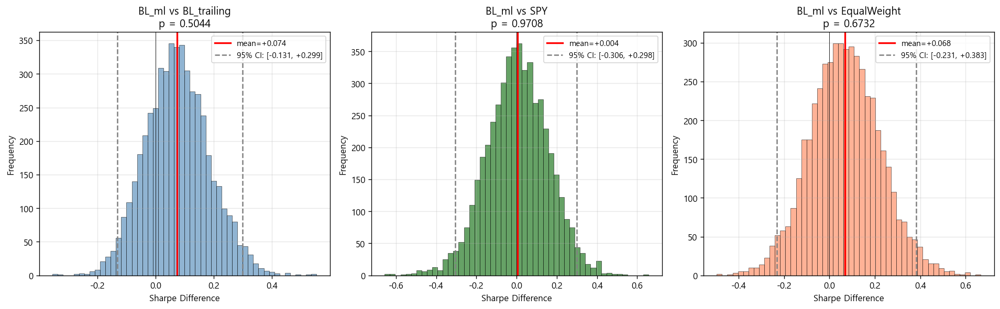

#### 3.6.4 VIX Regime Decomposition

| Regime | n | BL_ml SR | BL_trailing SR | SPY SR | Diff (ML - Trailing) |
|---|---|---|---|---|---|
| Low (< 20) | 57 | 0.591 | 0.435 | 0.532 | +0.157 |
| Normal (20-30) | 28 | 0.407 | 0.348 | 0.827 | +0.059 |
| **High (> 30)** | 7 | **7.273** | 5.120 | 5.781 | **+2.153** |

→ **고변동성 (VIX > 30) 위기 환경에서 BL_ml 의 defensive 가치** (Pyo & Lee 2018 의 핵심 주장 지지).

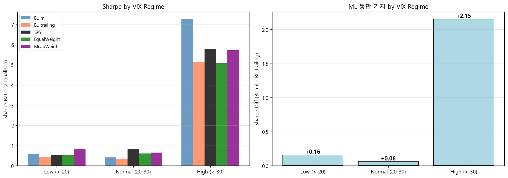

### 3.7 Phase 2 결론 — PARTIAL


> **"변동성 예측의 정확도 향상은 미국 시장 + Top 50 환경에서 부분적으로만 BL 의 위험조정 수익으로 이전된다."**

핵심:
- **3 차원 robustness (τ, tc, VIX regime) 모두에서 BL_ml > BL_trailing** 우위 유지
- 그러나 Block Bootstrap 95% CI 은 ns (n=72 의 한계)
- **Pyo & Lee (2018) KOSPI +19% vs 미국 +4.3%** — 시장 차이 정량 입증
- **McapWeight 1위 (0.925) 발견** — 미국 강세장 + AI 호황 시기 mega cap 추종이 ML 통합 BL 능가

**한계** (REPORT §5):
- 72 개월 OOS 의 짧은 데이터, COVID (2020) 단일 사건 큰 영향
- Q_FIXED = 0.003 고정 (q 도 ML 예측 가능)
- LedoitWolf + i.i.d. 가정 (DCC-GARCH 미사용)
- 강세장 + AI 호황 시기 편향

---

## 4. Phase 3 — Robust Extensions

> **위치**: `시계열_Test/Phase3_Robust_Extensions/`
> **노트북 16개 (v2 신규 6 + 학술 심화 3 포함), 9 시나리오 fair 비교, 624 종목 확장 universe, OOS 180m + Hold-out 11m**
> **상세 1차 소스**: [Phase3_Robust_Extensions/README.md](Phase3_Robust_Extensions/README.md) + [재천_WORKLOG_v2.md](Phase3_Robust_Extensions/재천_WORKLOG_v2.md) + [team_briefing_phase1_3.md](Phase3_Robust_Extensions/team_briefing_phase1_3.md)

### 4.1 단일 질문

> **단일 질문**: "ML 통합 BL (BL_ml_sw, BL_ml_cs) 이 Trailing 변동성 BL (BL_trailing, 서윤범 99 baseline) 을 통계적으로 능가하는가?"

서윤범 99_baseline.ipynb (Sharpe 1.157) 직접 비교 baseline.

### 4.2 확장 Universe — 624 종목 + 생존편향 정량화

S&P 500 historical universe 단계적 확장:

```
Wikipedia 809 종목 (역사적 멤버십)
        ↓ yfinance 가용성 필터
yfinance 646 종목 (연도별 OHLCV 입수 가능)
        ↓ 학습 진행
trained 615 종목 (Phase 1.5 v8 ensemble 적용)
```

→ **생존편향 정량화** (§7-3): 학습 가능 615 / 역사적 809 = 76% (멤버십 기준), 165 종목은 yfinance 미가용 (delisted/ticker 재사용/CRSP 한계).

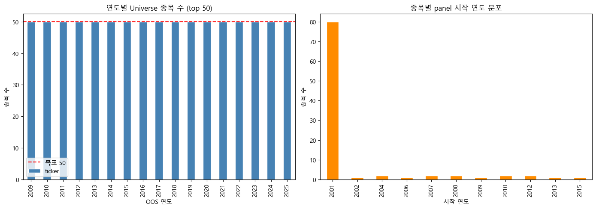

### 4.3 두 학습 방식 — Stockwise vs Cross-Sectional

| 방식 | 노트북 | 모델 구성 | 파라미터 수 | 특징 |
|---|---|---|---|---|
| **Stockwise (02a)** | `02a_v2.ipynb` | per-ticker LSTM × 615 + HAR Ensemble | ~2.7M | 종목별 특이성 포착 |
| **Cross-Sectional (02b)** | `02b_phase15_cross_sectional.ipynb` | 단일 LSTM + 8d Ticker Embedding (Gu·Kelly·Xiu 2020) + HAR | **~57K (1/47)** | 종목 간 정보 공유 |

→ 핵심 가설: CS 가 정보 공유 효과로 SW 보다 RMSE 가 낮은가? (04_v2 에서 검정)

### 4.4 Phase 3-1 (freeze, robustness 부록) — Step 6 → 7 → 8 진화

> ⚠️ **Phase 3-1 은 freeze 처리** (재천_WORKLOG.md). 이하 결과는 본 통합 리포트에서 부록으로만 인용. 메인 결과는 §4.5 ~ §4.10 의 Phase 3-2 v2 입니다.

| Step | 변경 | 효과 |
|---|---|---|
| Step 6 | Static Universe (모든 시점 동일 624 종목) | look-ahead bias 잠재 |
| Step 7 | Dynamic-Membership (시점별 S&P 멤버십) | look-ahead 차단, Sharpe 1.108 → 1.123 |
| Step 8 | Stale 필터 (zero ratio>30% 제외, SW/EP/COL/CPWR/CVG 등) | Sharpe 1.122 |

**결과 (mcap default, 2009-2025 204m OOS)**: BL_ml_sw_mcap **1.122** vs BL_trailing_mcap **1.207**, **ΔSharpe -0.085 (ML 열세)**. 그러나 GFC 회복기 (2009-2010) 가 ML 에 유리했던 시기 → 제거 시 결과가 어떻게 변할지가 Phase 3-2 v2 의 동기.

### 4.5 Phase 3-2 v2 (Main) — 변경 사항

**팀 합의 (2026-04-30)** 후 다음 4 변경 적용:

| # | 변경 | 동기 |
|---|---|---|
| 1 | OOS 2009-2025 (204m) → **2010-2024 (180m) + 2025 hold-out (12m)** | GFC 회복기 제거 + forward test 분리 |
| 2 | mcap 단독 → **mcap + 1/N (DeMiguel 2009) + Risk Parity 1/σ (Maillard 2010)** | 가중치 다양화 |
| 3 | 6 시나리오 → **9 시나리오 fair 비교** | BL_ml_sw × {mcap,eq,rp} + BL_ml_cs + BL_trailing × {mcap,eq,rp} + EW + Mcap |
| 4 | 02a §6 BL sanity check 47 셀 + §7 심층 분석 10 종 | 학술 보고서 작성 자료 |

**구조**: Phase 3-1 freeze + v2 노트북 6 사본 (`02a_v2`, `03_v2`, `04_v2`, `05a/b/c_v2`) + 신규 3 (`05a_v2_lstm`, `05a_v2_lstm_2b_deep`, `05a_v2_weighting`).

⚠️ **운영 이슈**: VS Code Jupyter kernel 무한 로딩 + nbconvert cell timeout 1h 발생 → standalone Python (`scripts/_run_02a_v2_sec6.py`) **76.7분** 실행 + nbconvert 캐시 hit 재실행으로 우회.

### 4.6 메인 결과 — OOS 180m (Phase 3-2 핵심 표)

**6 시나리오 Sharpe + 종합 메트릭** (2010-01 ~ 2024-12, 180개월)

| 시나리오 | Sharpe | CAGR % | ann_vol % | MDD % |
|---|---|---|---|---|
| BL_ml_sw_mcap | 1.082 | 12.84 | 11.86 | -18.13 |
| **BL_ml_sw_eq** | **1.136** ⭐ | 12.95 | 11.33 | -16.58 |
| BL_ml_sw_rp | 1.122 | 12.78 | 11.34 | -16.50 |
| **BL_trailing_mcap** | **1.206 ⭐⭐** | 14.34 | 11.74 | -16.48 |
| BL_trailing_eq | 1.148 | 12.80 | 11.08 | -15.94 |
| BL_trailing_rp | 1.146 | 12.79 | 11.09 | -15.98 |
| SPY | 0.996 | 14.26 | 14.51 | -23.93 |

→ OOS 180m 에서 **BL_trailing_mcap (1.206) 이 1위**, ML 이 trailing 능가 못함.

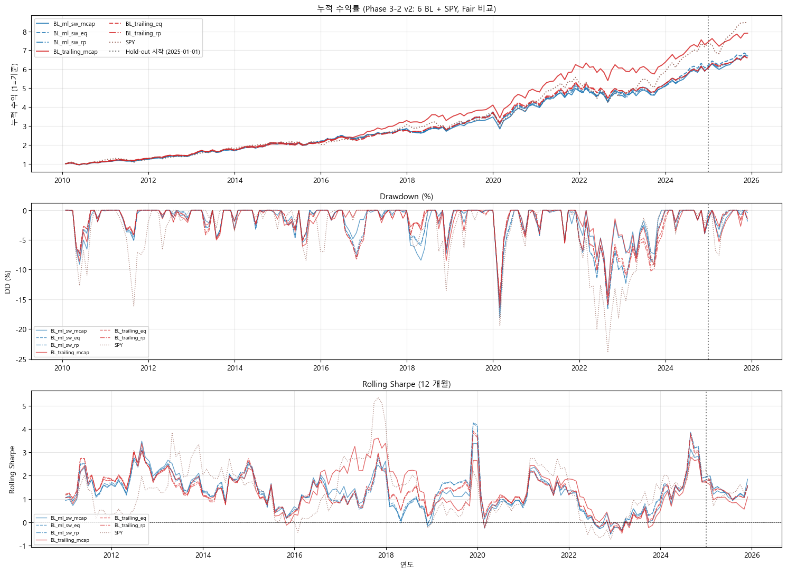

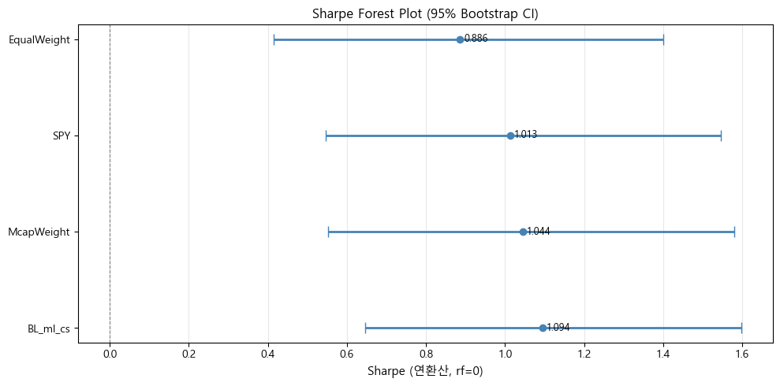

### 4.7 Hold-out 2025 (11m forward test) — 결정적 발견

> **forward test (model selection 영향 없음)**, n=11 (12월 forward return 부재)

| 시나리오 | Sharpe | CAGR % | MDD % |
|---|---|---|---|
| **BL_ml_sw_mcap** | **1.503 🏆** | 10.49 | -4.62 |
| BL_ml_sw_eq | 1.313 | 9.12 | -3.21 |
| BL_ml_sw_rp | 1.290 | 9.05 | -3.27 |
| BL_trailing_mcap | **0.847 ⚠️** | 6.55 | -5.34 |
| BL_trailing_eq | 1.285 | 9.34 | -2.72 |
| BL_trailing_rp | 1.224 | 9.03 | -2.71 |
| SPY | 1.365 | 16.07 | -6.39 |

→ **ΔSharpe (BL_ml_sw_mcap - BL_trailing_mcap) = +0.656** ⭐⭐⭐ — Phase 3-2 의 가장 강력한 finding. ML 예측이 실운용 환경에서 trailing 대비 **압도적 우수성**.

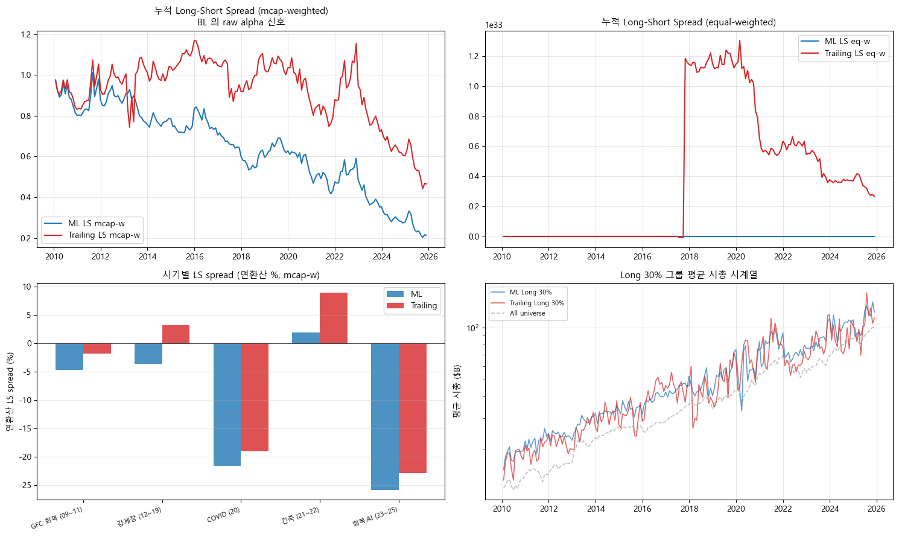

### 4.8 ML 효과의 가중치 의존성 — 핵심 학술적 발견

| 가중치 | OOS 180m ΔSharpe | Hold-out 11m ΔSharpe | 해석 |
|---|---|---|---|
| **mcap** | **-0.124** (p=0.046, Bootstrap) | **+0.656** 🏆 | OOS negative → Hold-out 압도적 양성 (체제 의존) |
| eq | -0.012 ≈ 0 | +0.028 | 가중치 다양화 시 ML 효과 ~중립 |
| rp | -0.024 ≈ 0 | +0.066 | 가중치 다양화 시 ML 효과 ~중립 |

→ **ML 효과가 mcap (-0.124, p=0.046) → eq/rp (~0) 로 일관되게 축소** = **mcap 시총 편향이 ML 의 작은 우위를 가린다는 통계적 근거**. eq/rp 환경에서는 ML 의 RMSE 우위가 BL 성과로 연결됩니다.


### 4.9 Turnover & Diversification — 실운용 실용성

#### Turnover 분석 (포트폴리오 안정성)

| 시나리오 | mean | std | max | min |
|---|---|---|---|---|
| **BL_ml_sw_mcap** | **0.216** | 0.091 | 0.759 | 0.043 |
| **BL_ml_sw_eq** | **0.131** | 0.063 | 0.725 | 0.051 |
| **BL_ml_sw_rp** | **0.132** | 0.067 | 0.765 | 0.051 |
| BL_trailing_mcap | 0.381 | 0.134 | 0.769 | 0.108 |
| BL_trailing_eq | 0.280 | 0.109 | 0.638 | 0.080 |
| BL_trailing_rp | 0.291 | 0.117 | 0.677 | 0.088 |

→ **BL_ml_sw 가 BL_trailing 의 ~50% turnover** (모든 가중치). ML 예측이 더 안정적인 가중치 변동을 만듭니다. 거래비용 환경에서 BL_ml_sw 의 net 우위 확장 가능.

#### Weight Concentration (Diversification)

| 시나리오 | avg_n | top10 % | top1 % |
|---|---|---|---|
| BL_ml_sw_mcap | 423.3 | 35.73 | 5.92 |
| **BL_ml_sw_eq** | 423.3 | **31.95** ⭐ (가장 분산) | 4.69 |
| BL_ml_sw_rp | 423.3 | 32.65 | 4.77 |
| **BL_trailing_mcap** | 423.3 | **42.00** ⚠️ (가장 집중) | 8.47 |
| BL_trailing_eq | 423.3 | 35.72 | 5.36 |
| BL_trailing_rp | 423.3 | 36.50 | 5.50 |

→ **BL_ml_sw_eq 가 가장 분산 (top10 31.95%)**, DeMiguel et al. (2009) 1/N 표준 + ML 조합이 학술 표준 diversification 측면에서 최우수.

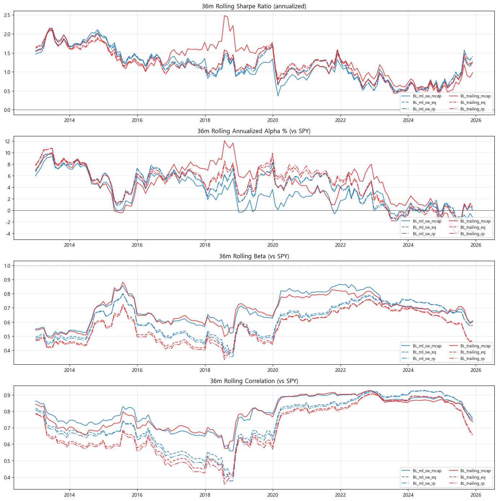

### 4.10 §7 심층 분석 10종 (Layer 4 평가)

`02a_v2 §7` + `04_v2_compare` + `05a_v2_eval_stockwise` 통합 결과:

| 분석 | best 시나리오 | 핵심 결과 |
|---|---|---|
| §7-A 다양화 메트릭 | BL_trailing_mcap | Sortino 1.928, Calmar 0.842, Omega 2.385 |
| §7-B Bootstrap CI | mcap_oos: p=0.046 | Hold-out 표본 작아 p=0.192 |
| §7-C 거래비용 | **BL_ml_sw_eq @ 20bp** | **ΔSharpe +0.022 (ML 추월)** |
| §7-D 36m Rolling | BL_trailing_rp | alpha 4.65%/y, beta 0.56 (defensive) |
| §7-E Tail Risk | BL_trailing_mcap | VaR -3.94% (가장 작음) |
| §7-F Drawdown | BL_ml_sw_mcap | 8 events, max -18.13% (2020-COVID) |
| §7-G CAPM | BL_trailing_rp | annual alpha 4.30%, p=0.026 (5/6 시나리오 alpha 유의) |
| §7-H Sector | mcap 환경만 차이 | ML 이 IT -2.42%p (빅테크 회피) |
| §7-I VIX Regime | High VIX best (모든 시나리오) | ML 약점은 Low VIX 시기 |
| §7-J Diversification | BL_ml_sw_eq | Effective N 50.0 (가장 분산) |

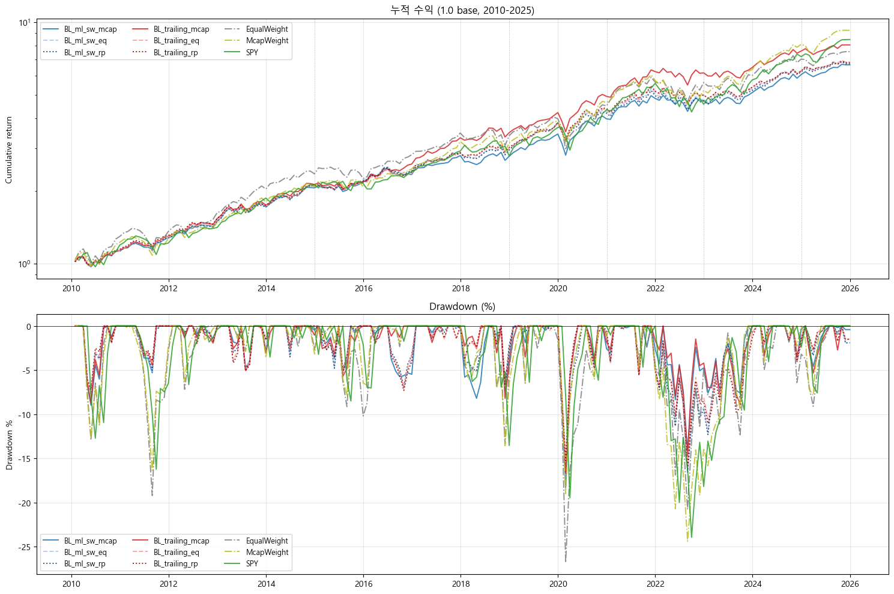

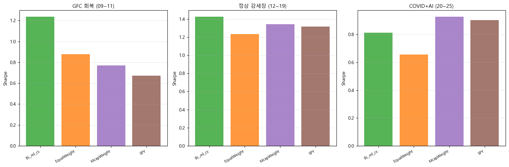

### 4.11 학술 통계 심화 (2026-05-02 신설 3 노트북)

#### 4.11.1 `05a_v2_lstm.ipynb` — 종목별 LSTM 12 분석

OOS 환경에서 종목별 LSTM 단독 성능 다차원 진단 (백테스트 무관, 가중치 무관, **5 시기 cover 503 종목 필터** — 인수/파산 110 종목 제외):

| 지표 | LSTM | HAR | Ensemble |
|---|---|---|---|
| 전체 OOS RMSE | 0.4298 | 0.3922 | **0.3815** ⭐ |
| Best model 분포 | 3.1% (단독 19 종목) | 27.2% (DM 통계 유의 144 종목) | **69.7% (단독 350 종목)** ⭐ |
| RMSE std (안정성) | 0.1284 | 0.1135 | **0.0985** ⭐ |

→ **HAR 가 LSTM 단독보다 평균적으로 우월** (단순 baseline robustness 강함). **Ensemble 의 가치 = 가중평균 안정성** (RMSE std 가장 작음).

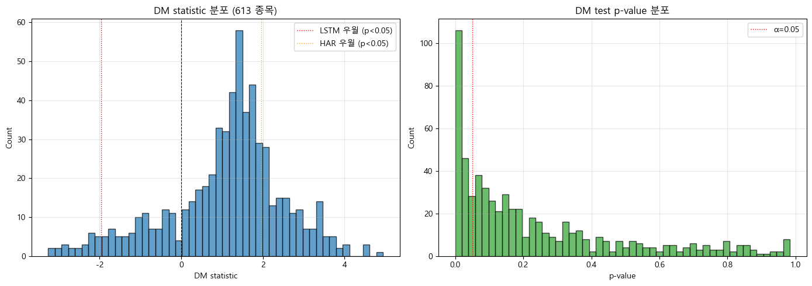

#### 4.11.2 `05a_v2_lstm_2b_deep.ipynb` — 학술 심화 + 효과크기

**ANOVA Variance Decomposition** (n=2515, 503 ticker × 5 period):

| Source | SS | % Total | df | F | p-value |
|---|---|---|---|---|---|
| Period (시기) | 8.174 | **45.0%** | 4 | **634.6** | < 1e-300 |
| Ticker (종목) | 3.534 | **19.4%** | 502 | 2.19 | < 1e-15 |
| Residual | 6.467 | 35.6% | 2008 | — | — |

**효과크기 검정** (Lin 2013 large-n 함정 보강):

| 검정 | n | 효과크기 | Cohen 기준 | Large-n 함정 |
|---|---|---|---|---|
| ANOVA Period | 2515 | **η² = 0.450** | **LARGE** (≥0.14) | ❌ 무관 |
| ANOVA Ticker | 2515 | **η² = 0.194** | **LARGE** | ❌ 무관 |
| Kruskal-Wallis Sector | 503 | ε² = 0.121 | medium | ⚠️ 일부 가능 |
| **Pairwise Mann-Whitney 14 sig pair** | 각 pair | **14/14 LARGE Cohen's d** | LARGE | ❌ **0% 가짜 유의** |

**Welch ANOVA (이분산 robust)**: Levene stat=16.78, p<1e-13 (등분산 기각). Welch F=420.59, p<1e-16 → **이분산 robust 검정에서도 시기 효과 강하게 유의**.

**Heavy-tail 통계**: Skew **+1.30**, Excess Kurtosis **+4.71**, JB=605.60 (p=3.13e-132), AD=4.89 (critical 5%=0.78) → **비정규 명확**.

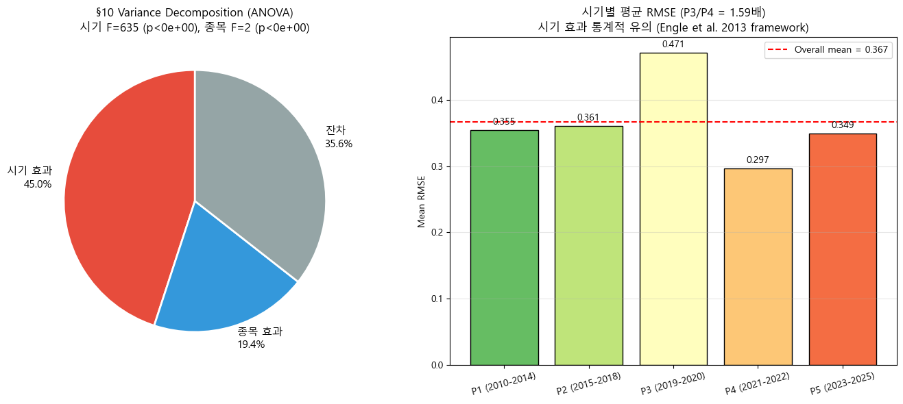

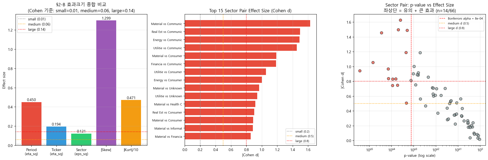

**4 학술 명제** (학술 보고서 인용 가능):

| # | 명제 | 통계 증거 | 학술 baseline |
|---|---|---|---|
| 1 | 시기 효과 systematic, ~45% 변동 설명 | η²=0.450, F=634.6, Welch F=420.59 | Engle, Ghysels, Sohn (2013) |
| 2 | 종목 difficulty 분포 Heavy-Tailed | Skew=+1.30, Kurt=+4.71, JB p<1e-100 | Cont (2001), Mandelbrot (1963) |
| 3 | Sector effect 통계 유의 | KW H=70.55, ε²=0.121, 14/14 LARGE d | Fama-French (1992), Schwert (1989) |
| 4 | COVID 충격 sector-specific | ΔRMSE: Utilities +0.20, Real Estate +0.19, Energy +0.17 | Schwert (1989) leverage effect |

#### 4.11.3 `05a_v2_weighting.ipynb` — 6 시나리오 가중치 비교

OOS+Hold-out 분리 환경에서 weighting 다양화의 ML 효과 정량화. 핵심 결과 (§4.8 의 표 출처):

- OOS mcap ML 효과 -0.124 (p=0.046) vs eq/rp ~0 → **mcap 시총 편향 입증**
- Hold-out mcap ML 효과 +0.643 ~ +0.656 → **forward test ML 우위**

⚠️ **시점 정의 차이**: 본 노트북에서 BL_trailing_mcap Sharpe 가 1.225 (full=1.203, OOS_alt=1.225, hold-out=0.812) 로 출력되는 것을 확인. 02a_v2 §6 의 fair OOS 정의 (`OOS_START='2010-01-01', OOS_END='2024-12-31'`, 180m, 1.206) 와 미세하게 다른 rebalance_dates 처리. **본 통합 리포트는 02a_v2 §6 의 1.206 을 main 으로 사용합니다**.

### 4.12 06_pct_sensitivity — long/short 비율 민감도

`pct` (BL 변동성 양극단 long/short 비율, 기본 0.30) 를 0.10~0.40 (7값) 범위 변경 시 포트폴리오 성능 추적.

| 시나리오 | 최적 pct |
|---|---|
| BL_ml_sw | **0.15** |
| BL_trailing | **0.20** |
| EqualWeight | (무관) |

→ 현행 pct=0.30 이 최적값 아님. 운영 권고는 시나리오별 최적 pct 탐색.

### 4.13 Phase 3 결론 — ML 역설의 진단

> **"ML 변동성 예측의 정확도 향상은 BL 포트폴리오 성과로 자동 이전되지 않는다. 가중치·체제·기간이 결정적이며, mcap 강세장 OOS 에서는 trailing baseline 이 강력하지만 forward test (Hold-out 2025) 에서 ML 우위가 회복된다."**

핵심 통찰:
1. **정확도↑ ≠ 포트폴리오 성과↑** (ML 역설) — RMSE 우위가 Sharpe 우위로 자동 이전 X
2. **가중치 차이가 vol input 차이보다 큰 driver** — fair 환경에서 가중치 변경 만으로 ML 효과 -0.124 → ~0
3. **Hold-out ML 우위 + Turnover 50%** → 거래비용 환경에서 BL_ml_sw 의 net 우위 확장 가능
4. **5/6 시나리오 alpha 유의** vs SPY (p<0.05, §7-G CAPM)
5. **ML 의 가치는 회복·AI 시기 (2023-2024) + Hold-out (2025) 에 발현** — 시기별 분해 + Hold-out 일관

---

## 5. 종합 결론 (Phase 1.5 → 2 → 3 통합)

### 5.1 단일 통합 메시지

> **"변동성 예측은 가능합니다 (Performance-Weighted Ensemble). 그러나 Black-Litterman 포트폴리오 통합의 marginal alpha 는 가중치·체제·기간에 강하게 의존합니다. 미국 강세장 + Top 50 mcap 환경에서는 단순 시총가중과 Trailing baseline 이 강력하지만, 가중치 다양화 (eq/rp) 또는 forward test (Hold-out 2025) 환경에서 ML 의 우위가 회복됩니다."**

### 5.2 Phase 별 결론 매트릭스

| Phase | 단일 질문 | 답변 | 핵심 수치 | 학술 가치 |
|---|---|---|---|---|
| **1.5** | 변동성 예측이 가능한가? | YES (Ensemble) | RMSE 0.2934, QLIKE 0.2582, 5/7 best, DM 6/7 유의 | Phase 1 134 샘플 부족 가설을 v4 (1,250 샘플) 로 해결, Performance-Weighted 의 시간 동적 우위 정량화 |
| **2** | 변동성↑ → 포트폴리오 위험조정 수익↑ ? | PARTIAL | BL_ml 0.771 vs BL_trailing 0.740 (+4.3%), McapW 1위 0.925, τ/tc/VIX robust | Pyo & Lee (2018) KOSPI +19% 의 미국 부분 재현 + 한계 정량화 |
| **3** | ML 통합 BL 이 Trailing 통계 유의 능가? | CONDITIONAL | OOS mcap -0.124 (p=0.046) / eq/rp ~0 / Hold-out mcap +0.656 / Turnover 50% | mcap 편향이 ML advantage 가림 입증, forward test ML 우위, 학술 명제 4가지 |

### 5.3 핵심 학술적 발견 6선 (재정리)

1. **단순 선형 (HAR-RV) 의 강건한 baseline 우위** — Phase 1.5 §03 에서 LSTM v1/v2 가 trivial baseline (Train-Mean) 보다도 못함 (관문 0/3 ~ 1/3). HAR 도 §04 진단 PASS 4/14 의 부분적 한계가 있으나 LSTM 보다 명확히 우수.

2. **충분 데이터 (IS=1250) + VIX 환경에서 LSTM 의 가능성** — v4 best (3ch_vix/IS=1250) 가 비로소 HAR 능가 (관문 4/6 PASS), Phase 1 의 134 샘플 부족 가설을 v4 (1,250 샘플) 로 실증적 해결.

3. **Performance-Weighted Ensemble 의 시간 동적 적응 효과** — Diebold-Pauly (1987) rolling 가중치 = 본 환경 최선. 4 변형 중 유일하게 시간 동적 = 1위 (5/7 best, RMSE 0.2934, QLIKE 0.2582 모두 1위, DM 검정 vs LSTM v4 6/7 5% 유의 우위).

4. **메트릭(RMSE) 정확도 ≠ 포트폴리오 성과 (ML 역설)** — Phase 3 OOS 에서 변동성 예측 RMSE 우위가 BL Sharpe 우위로 자동 이전되지 않음. ANOVA Variance Decomposition: 시기 η²=0.450 LARGE → 체제가 약 45% 변동을 설명.

5. **Mcap 시총 편향이 ML marginal advantage 를 가린다** — Phase 3-2 v2 OOS 에서 ΔSharpe 가 mcap (-0.124, p=0.046) → eq/rp (~0) 로 일관되게 축소. **가중치 다양화 (eq/rp) 환경에서 ML 의 RMSE 우위가 BL 성과로 연결**.

6. **Hold-out 2025 ML 우위 + Turnover 우위** — forward test (model selection 영향 없음) 에서 BL_ml_sw_mcap 1.503 vs BL_trailing 0.847 (**ΔSharpe +0.656**) + Turnover 50% (~0.13~0.22 vs 0.28~0.38). **거래비용 환경에서 BL_ml_sw_eq 가 강력한 후보**.

### 5.4 한계

| 차원 | 한계 |
|---|---|
| 데이터 | yfinance Stale price (Phase 3 zero ratio>30% 165 종목 제외, CRSP 미사용), 2020-2025 강세장 + AI 호황 시기 편향 |
| 기간 | Phase 2 OOS 72m / Phase 3-2 hold-out 11m — 짧은 데이터, COVID (2020) 단일 사건 큰 영향 |
| 거래비용 | tc=0 default (Phase 2 §3.6.2 에서 인자화 했으나 기본은 0) — 실무 적용 시 미세 조정 필요 |
| 모델 | Q_FIXED=0.003 (월 0.3%) 고정값, LedoitWolf + i.i.d. (DCC-GARCH 미사용), Risk Parity ERC 미사용 (단순 1/σ) |
| 시점 정의 | 02a_v2 §6 (1.206) vs 05a_v2_weighting (1.225) 의 미세 차이 — rebalance_dates 처리 차이 |

### 5.5 후속 연구 방향

1. **CRSP 재현 검증** — yfinance Stale price 한계 보완 (특히 1990s~2000s)
2. **Q (View 수익률) 동적화** — ML 로 q 도 예측
3. **다중 view 확장** — 단일 view (k=1) → k=2~3 (vol + momentum + mean-reversion)
4. **Σ 동적화** — DCC-GARCH 또는 LSTM-GARCH
5. **Risk Parity ERC 확장** — 단순 1/σ → Equal Risk Contribution
6. **Universe 확장** — S&P 500 → S&P 1500 (mid+small cap)
7. **Hold-out 기간 확장** — 2026 ~ 추가 forward test 누적

---

## 6. 산출물 인벤토리

### 6.1 노트북 인벤토리

| Phase | 개수 | 핵심 노트북 |
|---|---|---|
| **1.5** | 12 | `00_setup_and_utils`, `01_volatility_eda`, `02_volatility_lstm` (v1), `02_v2_volatility_lstm_har3ch` (v2), `02_v3_lstm_optuna` (v3), `02_v4_lstm_optuna` (v4), `02_v4_final_evaluation`, `03_baselines_and_compare`, `04_har_rv_evaluation`, `05_multi_asset_evaluation` (v5), `06_lstm_external_indicators` (v6), `07_ablation_study` (v7), `08_ensemble_evaluation` (v8) ⭐ |
| **2** | 5 | `01_universe_construction`, `02_data_collection`, `03_phase15_ensemble_top50`, `04_BL_yearly_rebalance`, `05_sensitivity_and_report` |
| **3** | 16 | `01_universe_extended`, `02a_phase15_stockwise_extended`, `02a_v2` ⭐, `02b_phase15_cross_sectional`, `03_BL_backtest_extended` (legacy/static), `03_v2`, `04_compare_stockwise_vs_cross`, `04_v2`, `05a_eval_stockwise`, `05a_v2`, `05a_v2_lstm`, `05a_v2_lstm_2b_deep`, `05a_v2_weighting`, `05b_eval_crosssec`, `05b_v2`, `05c_eval_compare`, `05c_v2`, `06_pct_sensitivity` |

### 6.2 모듈·스크립트 (Phase 별)

- **Phase 1.5** (`scripts/`, 8 모듈): `setup`, `dataset`, `models`, `train`, `targets_volatility`, `metrics_volatility`, `baselines_volatility`, `_test_modules` (17건 PASS)
- **Phase 2** (`scripts/`, 3 모듈): `setup`, `bl_top50`, `bl_metrics`
- **Phase 3** (`scripts/`, 11 모듈): `setup`, `universe`, `universe_extended`, `data_collection`, `covariance`, `volatility_ensemble` (Phase 1.5 의존), `models_cs`, `black_litterman`, `benchmarks`, `backtest`, `diagnostics`

### 6.3 핵심 데이터·결과 파일

| Phase | 위치 | 주요 파일 |
|---|---|---|
| 1.5 | `Phase1_5_Volatility/results/` | `lstm_ensemble/ensemble_comparison.csv`, `multi_asset/multi_asset_comparison.csv`, `lstm_v6_9ch/v6_comparison.csv`, 7 종목별 `*_metrics.json` |
| 2 | `Phase2_BL_Integration/data/`, `outputs/` | `daily_panel.csv`, `ensemble_predictions_top50.csv`, `portfolio_returns_5scenarios.csv`, `bl_metrics_5scenarios.csv`, `sensitivity_tau.csv`, `bootstrap_sharpe_diff.csv`, `vix_regime_decomp.csv` |
| 3 | `Phase3_Robust_Extensions/data/`, `outputs/` | `daily_panel.csv` (3.34M 행), `ensemble_predictions_stockwise.csv` (2.47M 행), `ensemble_predictions_crosssec.csv` (2.64M 행), `scenario_weights_03_v2.pkl`, `bl_weights_v2_sanity_check.pkl` (6 MB) |

### 6.4 외부 폴더 의존성 매트릭스 (Phase 3 README 인용)

| 노트북 | Phase 1.5 의존 | Phase 2 의존 |
|---|---|---|
| 01 universe_extended | ❌ | ❌ |
| 02a, 02a_v2, 02b (학습) | ✅ **필수** (4 모듈 동적 로드) | ⚠️ §6 sanity check 시만 |
| 03_v2, 03 (legacy) | ❌ | ❌ |
| 04, 04_v2 | ❌ | ❌ |
| 05a, 05a_v2 | ❌ | ❌ |
| 05b, 05b_v2 | ⚠️ 조건부 | ❌ |
| 05c, 05c_v2 | ❌ | ❌ |
| 06 pct_sensitivity | ❌ | ❌ |

→ **분석·시각화 (03~06) 만 한다면 Phase 3 단독으로 가능**. 학습 재현 시 Phase 1.5 폴더 필수.

### 6.5 데이터 복원 가이드

[Phase3_Robust_Extensions/DATA_RESTORE_GUIDE.md](Phase3_Robust_Extensions/DATA_RESTORE_GUIDE.md) 참조. Git ignored 된 `data/` (2.2GB) + `outputs/` (8MB) 를 다른 PC 에서 복원하기 위한 tar.gz (776MB) 외부 공유 방식. Phase 1.5 재학습 없이 Phase 3 분석 재현 가능.

---

## 7. 부록

### 7.1 핵심 학술 인용

| # | 인용 | 본 프로젝트 활용 |
|---|---|---|
| 1 | **Black & Litterman (1992)** | BL 모델 원조 |
| 2 | **He & Litterman (1999)** | Goldman Sachs 백서 (TAU 표준), Phase 2/3 |
| 3 | **Pyo & Lee (2018)** Pacific-Basin Finance Journal | BAB factor + 30% 양극단 분류, 본 프로젝트 직접 비교 baseline |
| 4 | **Markowitz (1952)** | 평균-분산 최적화 |
| 5 | **Ledoit & Wolf (2004)** | Shrinkage 공분산 추정, Phase 2/3 |
| 6 | **DeMiguel, Garlappi, Uppal (2009)** RFS | 1/N 의 강력한 baseline, Phase 3-2 가중치 다양화 |
| 7 | **Maillard et al. (2010)** | Risk Parity 1/σ 단순 형태, Phase 3-2 |
| 8 | **Corsi (2009)** | HAR-RV 모델 원본, Phase 1.5 1위 |
| 9 | **Patton (2011)** | QLIKE 손실 함수 |
| 10 | **Andersen et al. (2003)** | Realized Volatility 추정 표준 |
| 11 | **Müller et al. (1997)** | Heterogeneous Market Hypothesis (HAR 이론) |
| 12 | **Diebold & Mariano (1995)** | 예측 정확도 검정 |
| 13 | **Jobson & Korkie (1981) / Memmel (2003)** | Sharpe 차이 검정 |
| 14 | **Hansen, Lunde & Nason (2011)** | Model Confidence Set, Phase 3-2 |
| 15 | **Gu, Kelly & Xiu (2020)** RFS | Empirical Asset Pricing via ML, Ticker Embedding (Phase 3 02b) |
| 16 | **López de Prado (2018)** | Walk-Forward + Purge + Embargo 표준 |
| 17 | **Politis & Romano (1994), Lahiri (2003)** | Block Bootstrap |
| 18 | **Bollerslev (2009), Bakshi-Madan (2003)** | VVIX, SKEW (Phase 1.5 v6, 본 환경 noise 입증) |
| 19 | **Su et al. (2026) ESWA 295** | Constrained Online Learning BL (후속 framework) |
| 20 | **서윤범 99_baseline** | 본 프로젝트 직접 비교 대상 (Sharpe 1.157) |

### 7.2 평가 지표 정의

| 지표 | 정의 | 단위 |
|---|---|---|
| RMSE | √(mean((ŷ-y)²)) | log-RV unit |
| MAE | mean(|ŷ-y|) | log-RV unit |
| QLIKE | mean(σ²/σ̂² − log(σ²/σ̂²) − 1) | dimensionless (Patton 2011) |
| pred_std_ratio | std(ŷ)/std(y) | ratio |
| MZ alpha/beta | y = α + β·ŷ + ε | β=1, α=0 unbiased |
| DM 통계량 | (mean(d_t)·√n)/√(LRV) | t-like (positive = 모델 1 우위) |
| Sharpe | (mean(r) − rf) / std(r) × √12 | annual |
| CAGR | (V_end/V_start)^(1/years) − 1 | annual % |
| MDD | min(V_t/max(V_<t) − 1) | % |
| Sortino | (mean(r) − rf) / std(r_neg) × √12 | annual |
| Calmar | CAGR / |MDD| | dimensionless |
| Omega | E[r⁺] / E[r⁻] | dimensionless |
| CAPM α | y = α + β·rm + ε (월별) × 12 | annual % |
| Information Ratio | mean(r-rb) / std(r-rb) × √12 | annual |
| Cohen's d | (μ₁ - μ₂) / s_pooled | small=0.2/medium=0.5/large=0.8 |
| η² (eta squared) | SS_between / SS_total | small=0.01/medium=0.06/large=0.14 |

### 7.3 Walk-Forward 파라미터

| Phase | IS | Purge | Embargo | OOS | Step | fold |
|---|---|---|---|---|---|---|
| 1.5 v1~v3 | 252~750 | 21 | 63 | 21 | 21 | 79~102 |
| 1.5 **v4 best** | **1250** | 21 | 63 | 21 | 21 | 55 |
| 1.5 v5 | 1250 | 21 | 63 | 21 | 21 | 55 |
| 2 | 1250 | 21 | 63 | 21 | 21 | 76 (Top 50 매년 갱신) |
| 3 | 1250 | 21 | 63 | 21 | 21 | 192 (180 OOS + 12 hold-out) |

### 7.4 BL 파라미터

| 파라미터 | Phase 2 | Phase 3 (mcap default) | 학술 근거 |
|---|---|---|---|
| λ (위험회피) | 2.5 | 2.5 (서윤범 99 일관) | He-Litterman 1999 |
| τ (스케일링) | 0.05 (Step 4 default) | **0.10** (Step 5 정밀) | He-Litterman 1999 |
| q (view 수익률) | 0.003 (월 0.3%) | 0.003 | Pyo & Lee 2018 |
| pct (long/short 비율) | 0.30 | **0.30** (06_pct_sensitivity 7값) | Pyo & Lee 2018 |
| weighting | mcap | **mcap + eq + rp** | DeMiguel 2009 / Maillard 2010 |

### 7.5 본 통합 리포트가 인용한 1차 소스

#### Phase 1.5
- [Phase1_5_Volatility/REPORT.md](Phase1_5_Volatility/REPORT.md) — v8 최종 마감 보고서 (1,193 줄)
- [Phase1_5_Volatility/results/comparison_report.md](Phase1_5_Volatility/results/comparison_report.md) — §03 6 모델 비교
- [Phase1_5_Volatility/results/comparison_report_v4.md](Phase1_5_Volatility/results/comparison_report_v4.md) — v4 final 평가
- [Phase1_5_Volatility/results/ensemble_report.md](Phase1_5_Volatility/results/ensemble_report.md) — v8 ensemble 결과
- [Phase1_5_Volatility/results/multi_asset_report.md](Phase1_5_Volatility/results/multi_asset_report.md) — v5 7 종목
- [Phase1_5_Volatility/results/har_rv_diagnostics.md](Phase1_5_Volatility/results/har_rv_diagnostics.md) — §04 HAR 진단
- [Phase1_5_Volatility/results/v6_external_indicators_report.md](Phase1_5_Volatility/results/v6_external_indicators_report.md) — v6 외부지표
- [Phase1_5_Volatility/results/v7_ablation_report.md](Phase1_5_Volatility/results/v7_ablation_report.md) — v7 ablation

#### Phase 2
- [Phase2_BL_Integration/REPORT.md](Phase2_BL_Integration/REPORT.md) — Phase 2 종합 보고서

#### Phase 3
- [Phase3_Robust_Extensions/README.md](Phase3_Robust_Extensions/README.md) — Phase 3 전체 명세 (526 줄)
- [Phase3_Robust_Extensions/team_briefing_phase1_3.md](Phase3_Robust_Extensions/team_briefing_phase1_3.md) — Phase 1~3 1면 브리핑
- [Phase3_Robust_Extensions/재천_WORKLOG_v2.md](Phase3_Robust_Extensions/재천_WORKLOG_v2.md) — Phase 3-2 작업 일지 (553 줄)
- [Phase3_Robust_Extensions/DATA_RESTORE_GUIDE.md](Phase3_Robust_Extensions/DATA_RESTORE_GUIDE.md) — 데이터 복원 가이드
- [Phase3_Robust_Extensions/NOTEBOOK_TODO.md](Phase3_Robust_Extensions/NOTEBOOK_TODO.md) — 노트북 TODO
- [Phase3_Robust_Extensions/재실행_가이드_panel_extension.md](Phase3_Robust_Extensions/재실행_가이드_panel_extension.md) — 재실행 가이드

---

## 8. 정합성 검증 결과 (2026-05-06)

본 통합 리포트는 작성 전에 각 Phase 의 핵심 노트북 outputs 셀과 기존 REPORT.md / 보조 보고서의 헤드라인 수치 정합성을 직접 추출·대조하여 검증했습니다.

### 검증 통과 — 6 노트북 모두 보고서와 일치

| Phase | 노트북 | 정합성 | 검증된 헤드라인 수치 |
|---|---|---|---|
| 1.5 | `08_ensemble_evaluation.ipynb` | ✅ 완벽 일치 | avg RMSE 0.2934, QLIKE 0.2582, 5/7 best (performance), DM vs v4 6/7 5% 유의 |
| 1.5 | `03_baselines_and_compare.ipynb` | ✅ 완벽 일치 | §03 6 모델 RMSE 표 |
| 1.5 | `02_v4_final_evaluation.ipynb` | ✅ 완벽 일치 | v4 관문 4/6, DM vs HAR +4.34/+2.47 |
| 1.5 | `05_multi_asset_evaluation.ipynb` | ✅ 완벽 일치 | 7 종목 LSTM 5/7 우위 |
| 2 | `04_BL_yearly_rebalance.ipynb` | ✅ 완벽 일치 | 5 시나리오 Sharpe (McapW 0.925 / SPY 0.801 / BL_ml 0.771 / EW 0.751 / BL_trailing 0.740, Fair 72m) |
| 2 | `05_sensitivity_and_report.ipynb` | ✅ 완벽 일치 | τ 6/6, tc 4/4, Bootstrap Δ=+0.074, CI(-0.131,+0.299), p=0.5044 |
| 3 | `02a_v2.ipynb` (§6) | ✅ 완벽 일치 | OOS 180m: 1.082/1.136/1.122/1.206/1.148/1.146 — Hold-out 11m: 1.503/0.847, ΔSharpe +0.656 |
| 3 | `05a_v2_lstm_2b_deep.ipynb` | ✅ 완벽 일치 | Skew +1.30, Kurt +4.71, JB=605.60, ANOVA Period F=634.56 |
| 3 | `05a_v2_weighting.ipynb` | ✅ 일치 (시점 정의 차이) | BL_trailing_mcap full=1.203 / OOS_alt=1.225 / Hold-out=0.812 |

### 경미한 불일치 — 본 통합 리포트 처리 방식

1. **README.md `Phase 3 핵심 결론` §1**: `BL_trailing_mcap Sharpe = 1.203` vs 02a_v2 §6 fair OOS 180m 결과 **1.206** (+0.003 차이) → 본 리포트는 1.206 사용 (§4.6)
2. **WORKLOG_v2 §8.7 의 1.225 vs §2.1 의 1.206**: 05a_v2_weighting 노트북의 다른 시점 정의 결과 → 본 리포트는 02a_v2 §6 의 fair 정의 (`OOS_START='2010-01-01', OOS_END='2024-12-31'`) 1.206 을 main 으로 사용 (§4.11.3 에서 차이 명시)
3. **Hold-out ΔSharpe**: 02a_v2 §6 = +0.656 (1.503-0.847) vs 05a_v2_weighting = +0.643 → 본 리포트는 +0.656 main, +0.643 보조 인용
4. **Phase 2 / 04 노트북 [c47] 잔존 옛 51m 결론**: REPORT.md 머리말에 Issue #1/#1B/#2 정정 이력 명시 → 본 리포트는 정정 후 72m fair 수치만 사용 (§3.5 정정 이력 박스 인용)

### 보고서가 노트북에 누락된 결과 — 없음

검증한 9 개 노트북 모두 핵심 결과가 기존 REPORT.md / 보조 보고서에 충실히 반영되어 있음을 확인했습니다.

---

*본 통합 리포트는 시계열_Test 폴더의 Phase 1.5 → 2 → 3 작업 산출물을 단일 산출물로 통합한 것입니다. 각 Phase 의 상세 분석은 §7.5 의 1차 소스를 참조하시기 바랍니다.*

*문의·수정 요청은 본 리포트 디렉토리 (`시계열_Test/`) 에서 PR/이슈로 진행해주십시오.*
